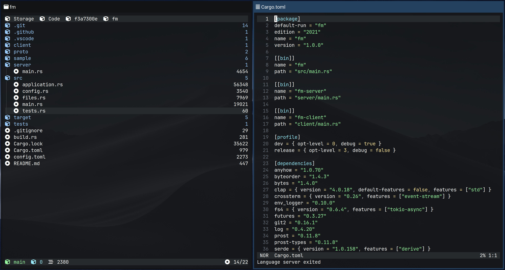

# File manager

A tree-based terminal file manager written in Rust.

The primary goal of this file manager is to view and manipulate files in code repositories.

It uses a tree view, and presents information useful to developers, such as git status of files or lines of code in a repository.

That said, it can also be used as a regular file manager.

I've used terminal file managers such as `ranger` or `lf` in the past but most of them prioritize the pane-based navigation which isn't great for code repositories.

I use `fm` primarily for code development like so:

## Features

This is a list of features and design decisions for `fm`:

- Tree-based view instead of a pane-based view like `ranger` or `lf`.

- Dynamic interface based on file system events (no need to reload the view manually).

- Composable with other aspects of a unix system (e.g. shell).

- Respects XDG standards and various unix conventions.

- Client/server architecture allows for file operations across multiple clients.

- Built-in `git` integration which provides useful information about code repositories.

- Non-blocking (async) implementation using Tokio.

- Keybindings, commands and behaviour can be configured through a global TOML configuration file `config.toml`.

- Can be used as a file picker (I use it with `xdg-desktop-portal` to select files).

- Makes use of unicode icons which can be configured for each file type ``.

- Mouse integration for scrolling, navigating directories and opening files.

## Configuration

The file manager can be configured using a configuration file typically located in `$XDG_CONFIG_HOME/fm/config.toml`.

A sample configuration file is present in the root of the repository `/config.toml`.

## Keybindings

**Note:** Keybindings can be changed in the configuration file.

| Key | Description |
|:--|:--|
| `:` | Enter command prompt |
| `x` | Expand or collapse directory |
| `left`| Collapse directory |
| `right` | Expand directory |
| `;` | Change root down |
| `j` | Change root up |
| `q` | Quit |
| `Q` | Quit and `cd` to current directory |
| `h` | Approve selected file in file chooser mode |
| `k` or `down` | Move down |
| `l` or `up` | Move up |
| `space` | Select a file |
| `F` | Open a file manager in current directory |
| `E` | Edit file in external window |
| `e` | Edit file in the same window |
| `S` | Open shell in external window |
| `s` | Open shell in the same window |
| `Ctrl-s`| Open shell in the root directory |
| `i` | Preview file information |
| `o` | Open file using `xdg-open` |
| `r` | Rename file or selected files |
| `T`| Trash files |
| `/` | Search files recursively in child directories |
| `f` | Find a file in currently visible files |
| `Ctrl-r` | Refresh view |
| `y` | Copy file or selected files |
| `c` | Cut file or selected files |
| `p` | Paste copied or cut files |
| `Z` | Toggle hidden files |
| `C` | Clear selection |
| `gg` | Jump to top |
| `ge` | Jump to bottom |

## Commands

| Command | Description |
|:--|:--|
| `new-file <name>` | Create a new file with the specified name |
| `new-dir <name>` | Create a new directory with the specified name |

